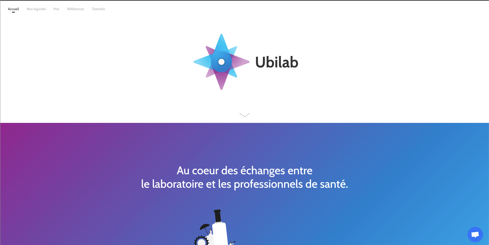
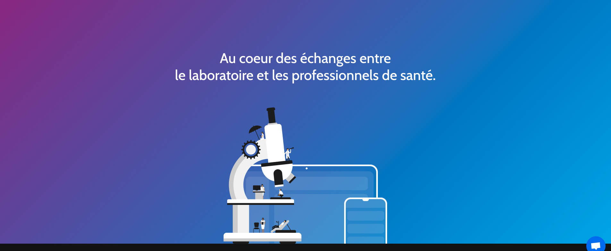

# Test technique front-end Ubilab

Ce repo contient un setup minimal comprenant **Sass** et **TypeScript** pour la partie intégration, et `Jest` pour la partie tests unitaires.

La commande `npm start` lance un serveur local sur le port `8080`. Il vous suffira de lancer cette commande et vous pourrez commencer à coder.

La commande `npm test` permet de lancer les tests unitaires situés dans le dossier `tests`.

# Premier exercice integration HTML

Dans cet exercice vous devrez intégrer la page d'accueil d'Ubilab en suivant les screeshoot suivants : 

## Début de page

## Bas de page

# Deuxième exercice TypeScript 

Crée un fork de ce repo
Cloner le repo sur votre ordinateur, puis npm install
L'objectif et de faire passer tous les tests unitaires 1 à 1 dans l'ordre. (ng test)
Chaque étape doit être une branche git crée et chaque test unitaire un nouveau commit.
Vous pouvez modifier comme vous le souhaitez les fichiers, tant que les tests unitaire passe. (c'est même conseillé :D)
Nous ne voulons pas que vous ajoutiez de librairie ( ex : lodash) pour vous aider dans ce projet

## Chez Ubilab nous aimons :

le code simple lisible et élégant
le code maintenable,
le code testable,

Ayez toujours à l'esprit que c'est principalement ces critères que nous jugerons.

